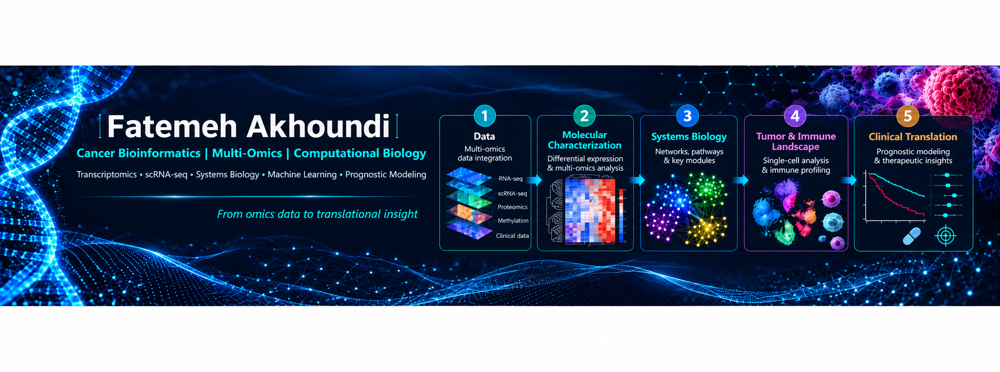

<p align="center">
  
</p>

<p align="center">
  
  
  
  
  
</p>

---

## 🔬 Overview & Scientific Scope

This repository presents an **end-to-end, reproducible computational pipeline** for multi-omics data integration, cancer genomics, co-expression network architecture, machine learning prognostic modeling, and translational biomarker discovery.

Developed and maintained by **Fatemeh Akhoundi** (Computational Biologist & Cancer Bioinformatician), this repository highlights production-grade analytical workflows implemented in **R**.

---

## 🧩 Analytical Modules

| Stage | Module Name | Key Methodologies | Core R Packages & Tools |
| :--- | :--- | :--- | :--- |
| **01** | **Data Acquisition & Harmonization** | TCGA/GEO/GTEx querying, GDC API, RNA-seq count processing, TMM/vst normalization | `TCGAbiolinks`, `GEOquery`, `SummarizedExperiment`, `DESeq2` |
| **02** | **Differential Expression & Functional Profiling** | Linear models for microarrays/RNA-seq, empirical Bayes moderation, GSEA, ORA | `limma`, `edgeR`, `clusterProfiler`, `GSVA`, `org.Hs.eg.db` |
| **03** | **Systems Biology & Co-expression Networks** | Scale-free topology fit, soft-thresholding, dynamic tree cut, module-trait eigengenes | `WGCNA`, `igraph`, `Cytoscape` (RCy3) |
| **04** | **Tumor Microenvironment & Immune Deconvolution** | Single-cell clustering, marker discovery, bulk immune infiltration estimation | `Seurat`, `SingleR`, `immunedeconv`, `ESTIMATE` |
| **05** | **Machine Learning & Prognostic Modeling** | LASSO feature selection, univariate/multivariate Cox regression, time-dependent ROC, Nomograms | `glmnet`, `survival`, `survminer`, `timeROC`, `rms` |

---

## 📁 Repository Structure
```text
├── assets/
│   └── pipeline_banner.png          # High-resolution pipeline workflow banner
├── scripts/
│   └── Cancer_MultiOmics_Pipeline_Demo.R  # Modular workflow demonstration script
├── .gitignore
├── LICENSE
└── README.md                        # Documentation & pipeline overview

